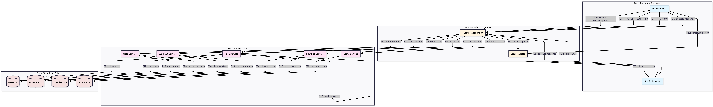

## Границы доверия (Trust Boundaries)

### 1. External (Внешний периметр)
- **Описание:** Конечные пользователи (браузеры, мобильные клиенты, администраторы)
- **Уровень доверия:** Нулевой
- **Контроль:** HTTPS, JWT-аутентификация, валидация данных

### 2. Edge (Граница API)
- **Описание:** Точка входа — FastAPI и сервис аутентификации
- **Уровень доверия:** Низкий
- **Контроль:** Проверка токенов, rate limiting, централизованная обработка ошибок
- **Компоненты:** API, Authentication Service

### 3. Core (Ядро системы)
- **Описание:** Основная бизнес-логика приложения
- **Уровень доверия:** Средний
- **Контроль:** Авторизация, валидация идентификаторов пользователей, бизнес-правила
- **Компоненты:** Workout Service, Exercise Service, Stats Service, User Service

### 4. Data (Слой данных)
- **Описание:** Уровень хранения и доступа к данным
- **Уровень доверия:** Высокий
- **Контроль:** Изоляция данных пользователей, хеширование паролей, защита от SQL-инъекций
- **Компоненты:** Users DB, Workouts DB, Exercises DB, Sessions DB

---

## Таблица потоков данных

| ID  | Откуда → Куда | Канал/Протокол | Данные/PII | Trust Boundary Cross | Комментарий |
|-----|----------------|----------------|-------------|----------------------|--------------|
| F1  | User → API | HTTPS | email, password | External → Edge | Регистрация нового пользователя |
| F2  | User → API | HTTPS | email, password | External → Edge | Авторизация пользователя |
| F3  | API → Auth | Internal call | user credentials | Edge → Core | Проверка учётных данных |
| F4  | Auth (internal) | In-process | password → hash | Core (internal) | Хеширование пароля Argon2id |
| F5  | Auth → UserDB | Internal call | user data | Core → Data | Сохранение пользователя |
| F6  | Auth → UserDB | Internal call | query user | Core → Data | Проверка учётной записи |
| F7  | Auth → API | Internal call | JWT tokens | Core → Edge | Генерация токена доступа |
| F8  | API → User | HTTPS | access_token, refresh_token | Edge → External | Возврат токенов клиенту |
| F9  | User → API | HTTPS + JWT | workout data | External → Edge | Создание тренировки |
| F10 | API → Auth | Internal call | token | Edge → Core | Валидация токена |
| F11 | Auth → API | Internal call | user_id | Core → Edge | Подтверждение пользователя |
| F12 | API → WorkoutSvc | Internal call | workout data | Edge → Core | Передача данных для обработки |
| F13 | WorkoutSvc → WorkoutDB | Internal call | workout record | Core → Data | Сохранение тренировки |
| F14 | WorkoutSvc → WorkoutDB | Internal call | query workouts | Core → Data | Получение списка тренировок |
| F15 | WorkoutSvc → API | Internal call | response data | Core → Edge | Подготовка ответа |
| F16 | API → User | HTTPS | workout response | Edge → External | Возврат результата пользователю |
| F17 | User → API | HTTPS + JWT | exercise data | External → Edge | Создание упражнения |
| F18 | API → Auth | Internal call | token | Edge → Core | Проверка токена |
| F19 | Auth → API | Internal call | user_id | Core → Edge | Подтверждение пользователя |
| F20 | API → ExerciseSvc | Internal call | exercise data | Edge → Core | Вызов сервиса упражнений |
| F21 | ExerciseSvc → ExerciseDB | Internal call | exercise record | Core → Data | Сохранение упражнения |
| F22 | ExerciseSvc → ExerciseDB | Internal call | query exercises | Core → Data | Получение упражнений |
| F23 | ExerciseSvc → API | Internal call | response | Core → Edge | Возврат результата |
| F24 | API → User | HTTPS | exercise response | Edge → External | Возврат данных пользователю |
| F25 | User → API | HTTPS + JWT | stats request | External → Edge | Запрос статистики |
| F26 | API → Auth | Internal call | token | Edge → Core | Проверка токена |
| F27 | Auth → API | Internal call | user_id | Core → Edge | Идентификация пользователя |
| F28 | API → StatsSvc | Internal call | user_id | Edge → Core | Передача идентификатора пользователя |
| F29 | StatsSvc → WorkoutDB | Internal call | query workouts | Core → Data | Сбор тренировок для отчёта |
| F30 | StatsSvc → WorkoutDB | Internal call | query sets | Core → Data | Получение данных подходов |
| F31 | StatsSvc → API | Internal call | aggregated stats | Core → Edge | Возврат статистики |
| F32 | API → User | HTTPS | stats response | Edge → External | Возврат статистических данных |
| F33 | Admin → API | HTTPS + JWT | admin request | External → Edge | Админский запрос |
| F34 | API → Auth | Internal call | admin token | Edge → Core | Проверка прав администратора |
| F35 | Auth → API | Internal call | admin_id | Core → Edge | Подтверждение администратора |
| F36 | API → ExerciseSvc | Internal call | admin query | Edge → Core | Запрос на все упражнения |
| F37 | ExerciseSvc → ExerciseDB | Internal call | query all exercises | Core → Data | Получение всех упражнений |
| F38 | ExerciseSvc → API | Internal call | all exercises | Core → Edge | Возврат данных |
| F39 | API → Admin | HTTPS | exercises list | Edge → External | Результат админского запроса |
